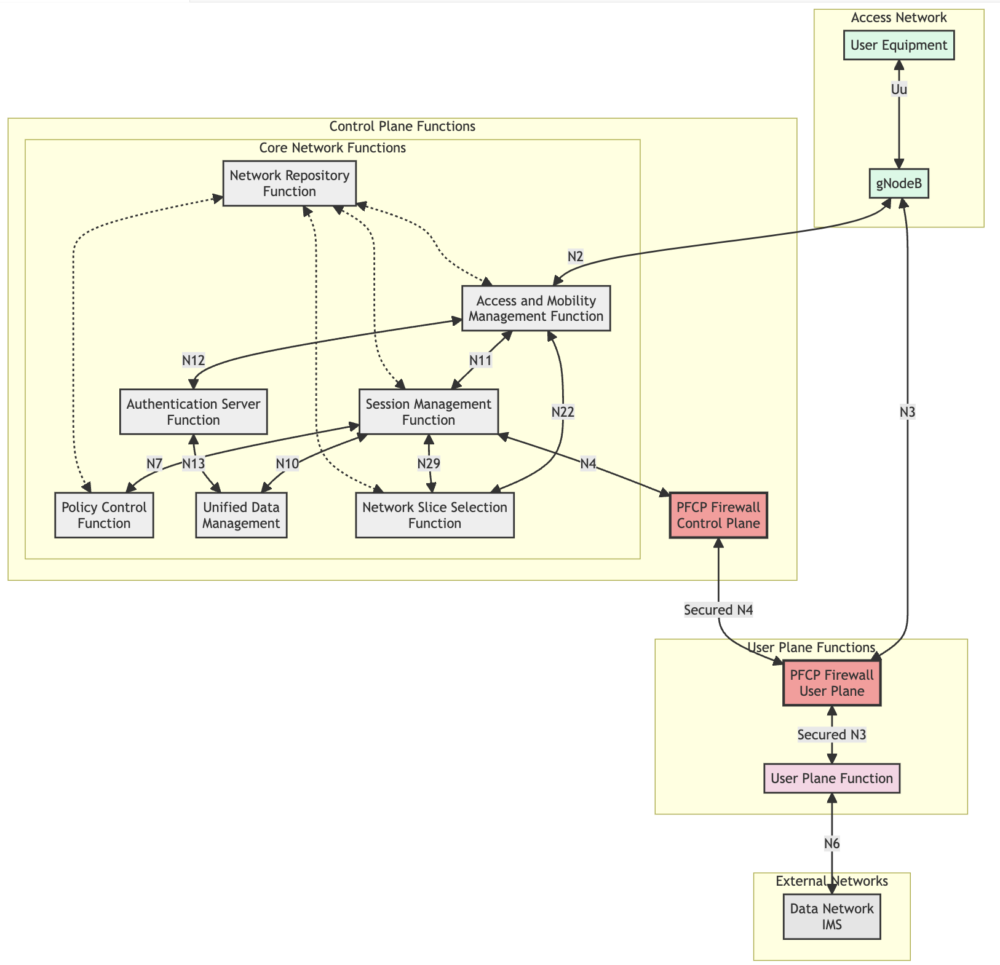

# PFCP Firewall

A high-performance, secure implementation of a Packet Forwarding Control Protocol (PFCP) Firewall following 3GPP TS 29.244 and TS 33.513 specifications. This firewall provides comprehensive security features including DoS protection, rate limiting, and CUPS (Control and User Plane Separation) architecture support.


## Features

### Protocol Compliance and Standards

The firewall implements full compliance with key 3GPP specifications:

- TS 29.244 Compliance: Implements all mandatory PFCP procedures including session establishment, modification, and deletion. The implementation supports both Sxa and Sxb interfaces for communication between control and user plane functions.
- TS 33.513 Security Requirements: Incorporates comprehensive security measures as defined in the 3GPP security specifications, ensuring robust protection against various network threats and attacks.

### CUPS Architecture Implementation
The Control and User Plane Separation (CUPS) architecture is fully supported with:

- Dedicated Plane Processing: Separate handling of control plane (CP) and user plane (UP) traffic with specialized processing pipelines for each.
- Interface Management: Implementation of Sxa and Sxb interfaces for CP-UP communication.
- Dynamic Resource Allocation: Intelligent resource management between control and user plane functions.
- Session Management: Comprehensive session handling with support for establishment, modification, and termination procedures.

### Security Features

#### DoS Protection System

- Connection Tracking: Maintains detailed statistics of connections per IP address.
- Configurable Thresholds: Customizable limits for:
  - Maximum connections per IP (default: 1000)
  - Connection rate per time window (default: 10000 packets/second)
  - Session duration and timeout parameters
- Automated Threat Response: Dynamic blocking of IPs exceeding security thresholds.

#### Advanced Rate Limiting

- Token Bucket Algorithm: Implements precise traffic shaping with:
  - Configurable bucket size (default: 100 tokens)
  - Adjustable token replenishment rate (default: 10 tokens/second)
  - Burst handling capabilities
- QoS Enforcement: Support for different traffic classes and priorities.
- Adaptive Rate Control: Dynamic adjustment based on network conditions.

#### Intelligent IP Filtering

- Dynamic Threat Detection: Real-time analysis of traffic patterns and behavior.
- Threat Scoring System: Accumulative scoring mechanism for identifying potentially malicious sources.
- Whitelist/Blacklist Management: Dynamic maintenance of allowed and blocked IP addresses.
- Automatic Rule Generation: Creation of filtering rules based on observed threats.

#### Cryptographic Security

- Packet Authentication: HMAC-SHA256 implementation for packet verification.
- Digital Signatures: RSA-based signing for secure message exchange.
- Key Management: Secure handling of cryptographic keys with proper rotation policies.
- SSL/TLS Support: Secure transport layer communication with configurable cipher suites.

#### Comprehensive Security Logging

- Multi-Level Logging: Support for different severity levels (DEBUG, INFO, WARNING, ERROR, CRITICAL).
- Detailed Event Recording: Captures security events, performance metrics, and system status.
- Syslog Integration: Compatible with system logging facilities for centralized log management.
- Audit Trail: Maintains detailed records of all security-relevant events.

### Performance Optimization

- Thread-Safe Design: All components are designed for concurrent operation with proper synchronization.
- Lock-Free Algorithms: Utilization of atomic operations where possible to minimize contention.
- Performance Monitoring: Built-in metrics for:
  - Packet processing latency
  - Queue depths
  - Resource utilization
  - Session statistics


### Session Management

- Stateful Processing: Maintains session state for all active connections.
- Resource Cleanup: Automatic cleanup of expired sessions and resources.
- Session Persistence: Optional persistence of session information for recovery.
- Concurrent Session Support: Handles multiple simultaneous sessions with efficient resource allocation.

### Extensibility and Integration

- Modular Architecture: Easy integration of new features and protocols.
- API Support: Well-defined interfaces for external system integration.
- Configuration Management: Dynamic configuration updates without service interruption.
- Monitoring Interface: Exposes metrics and status information for external monitoring systems.

### Summary 
- Full compliance with 3GPP TS 29.244 and TS 33.513 specifications
- Control and User Plane Separation (CUPS) architecture support
- Advanced security features:
  - DoS protection with configurable thresholds
  - Token bucket-based rate limiting
  - IP filtering with dynamic threat detection
  - Packet authentication using HMAC-SHA256
  - Comprehensive security logging
- Thread-safe session management
- Performance monitoring and optimization

## Prerequisites

Before building the PFCP Firewall, ensure you have the following dependencies installed:

### Essential Build Tools
```bash
# Ubuntu/Debian
sudo apt-get update
sudo apt-get install build-essential cmake git

# CentOS/RHEL
sudo yum groupinstall "Development Tools"
sudo yum install cmake git

# macOS
xcode-select --install
brew install cmake
```

### OpenSSL Development Libraries

```bash
# Ubuntu/Debian
sudo apt-get install libssl-dev

# CentOS/RHEL
sudo yum install openssl-devel

# macOS
brew install openssl@3
```

## Building from Source

1. Clone the repository:
```bash
git clone https://github.com/yourusername/pfcp_firewall.git
cd pfcp_firewall
```

2. Create and enter the build directory:
```bash
mkdir build
cd build
```

3. Configure the build:

For Linux:
```bash
cmake ..
```

For macOS (specify OpenSSL path):
```bash
cmake .. -DOPENSSL_ROOT_DIR=/opt/homebrew/opt/openssl@3
```

4. Build the project:
```bash
make
```

The compiled binary will be available as `./pfcp_firewall` in the build directory.

## Configuration

The firewall uses default configurations that can be modified at runtime:

- Control Plane Port: 8805 (standard PFCP port)
- User Plane Port: 8806
- Maximum Sessions: 10,000
- Queue Size: 1,000
- Session Timeout: 1000ms

## Running the Firewall

After building, you can run the firewall:

```bash
./pfcp_firewall
```

The firewall will start with default settings and create a log file at `pfcp_firewall.log`.

## Development Setup

For development work, you might want to install additional tools:

```bash
# Ubuntu/Debian
sudo apt-get install clang-format clang-tidy valgrind

# CentOS/RHEL
sudo yum install clang clang-tools-extra valgrind

# macOS
brew install clang-format llvm valgrind
```

## Troubleshooting

### Common Build Issues

1. OpenSSL Not Found (macOS):
```bash
# Solution: Specify OpenSSL path explicitly
cmake .. -DOPENSSL_ROOT_DIR=/opt/homebrew/opt/openssl@3
```

2. Compilation Errors:
```bash
# Ensure all dependencies are installed
# Check compiler version supports C++17
g++ --version
```

3. Runtime Permission Issues:
```bash
# Allow binding to privileged ports
sudo setcap cap_net_bind_service=+ep ./pfcp_firewall
```

## Security Considerations

- The firewall must run with appropriate permissions to bind to network ports
- Regular security audits are recommended
- Monitor `pfcp_firewall.log` for security events
- Configure system limits appropriately:

```bash
# Add to /etc/security/limits.conf
* soft nofile 65535
* hard nofile 65535
```

## License

[Your License Here]

## Contributing

1. Fork the repository
2. Create your feature branch
3. Commit your changes
4. Push to the branch
5. Create a new Pull Request

## Support

For issues and support:
- Create an issue in the GitHub repository
- Check the security logs at `pfcp_firewall.log`
- Review the 3GPP specifications for implementation details

# PFCP Firewall - Future Development Roadmap

This document outlines planned expansions and future development directions for the PFCP Firewall, aligned with emerging standards from 3GPP, IETF, ITU, and IEEE. These enhancements aim to address evolving network security needs and upcoming technological advancements in mobile networks.

## 5G Advanced and 6G Integration Pathways

### Network Slicing Security (3GPP TS 33.511)
The implementation will be expanded to include enhanced security mechanisms for network slicing, incorporating:

- Dynamic slice isolation with dedicated security policies per slice
- Cross-slice security coordination and threat mitigation
- Slice-aware authentication and authorization mechanisms
- Integration with 5G service-based architecture (SBA) security framework
- Support for ultra-reliable low-latency communication (URLLC) slice security

### Zero-Trust Architecture Integration (IETF RFC 9401)
Following IETF's zero-trust networking principles, future implementations will include:

- Continuous authentication and authorization for all network elements
- Real-time security posture assessment
- Dynamic trust scoring for network entities
- Micro-segmentation support for enhanced security isolation
- Integration with Software-Defined Perimeter (SDP) architecture

### AI/ML-Enhanced Security (ITU-T Y.3172)
Incorporating artificial intelligence and machine learning capabilities for:

- Predictive threat detection and prevention
- Anomaly detection in network behavior
- Automated security policy optimization
- Traffic pattern analysis and adaptive response
- Self-healing security mechanisms

## Enhanced Protocol Support

### Time-Sensitive Networking (IEEE 802.1Q-2022)
Implementation of TSN features for industrial and mission-critical applications:

- Time-aware shaping and scheduling
- Frame preemption for critical traffic
- Enhanced stream reservation protocol support
- Integration with IEEE 802.1CB for frame replication
- Support for deterministic networking requirements

### QUIC Protocol Integration (IETF RFC 9000)
Support for QUIC transport protocol security features:

- Enhanced connection migration
- Low-latency connection establishment
- Improved multiplexing without head-of-line blocking
- Integration with TLS 1.3 for enhanced security
- Advanced congestion control mechanisms

## Advanced Security Features

### Post-Quantum Cryptography (NIST SP 800-208)
Preparation for quantum-resistant security:

- Implementation of quantum-resistant algorithms
- Hybrid cryptographic schemes
- Key encapsulation mechanisms (KEM)
- Lattice-based cryptography support
- Support for quantum key distribution (QKD) integration

### Enhanced DDoS Protection (IETF RFC 8783)
Advanced distributed denial-of-service protection mechanisms:

- Machine learning-based attack detection
- Collaborative threat intelligence sharing
- Blockchain-based trust frameworks
- Automated mitigation strategy selection
- Edge-based early detection mechanisms

## Cloud-Native Capabilities

### Service Mesh Integration (ISTIO/CNCF)
Enhanced service mesh capabilities for cloud environments:

- Dynamic traffic management
- Fine-grained access control
- Automated certificate management
- Observability and monitoring
- Policy enforcement at service level

### Container Security (OCI Standards)
Implementation of container-specific security features:

- Runtime security enforcement
- Image scanning and verification
- Secure container networking
- Resource isolation and control
- Vulnerability management

## Performance Optimizations

### SmartNIC Offloading (P4 Programming)
Support for hardware acceleration through SmartNICs:

- Programmable packet processing
- Hardware-accelerated encryption
- Flow classification offloading
- Direct memory access optimization
- Custom pipeline implementation

### DPDK Integration
Enhanced packet processing capabilities through DPDK:

- Zero-copy packet processing
- Poll-mode drivers
- Huge pages support
- CPU core affinity optimization
- Memory pool management

## Standardization Contributions

### 3GPP Standards Alignment
Continuous alignment with emerging 3GPP standards:

- Release 18 (5G Advanced) security features
- Release 19 security enhancements
- 6G security framework preparation
- Network slice security improvements
- Enhanced security for non-public networks (NPN)

### IETF Protocol Development
Participation in IETF working groups for:

- Security protocol enhancements
- Transport layer security evolution
- Network function virtualization security
- Intent-based networking security
- Network automation security

## Implementation Timeline

### Phase 1 (6-12 Months)
- Zero-Trust Architecture Integration
- Enhanced DDoS Protection
- Container Security Implementation
- DPDK Integration

### Phase 2 (12-24 Months)
- AI/ML Security Features
- Time-Sensitive Networking Support
- SmartNIC Offloading
- Service Mesh Integration

### Phase 3 (24-36 Months)
- Post-Quantum Cryptography Implementation
- 6G Security Framework Preparation
- Advanced Network Slicing Security
- Complete Cloud-Native Integration

## Contribution Guidelines

We encourage community participation in these development efforts. Contributors should:

1. Align implementations with relevant standards
2. Provide comprehensive documentation
3. Include test cases and performance benchmarks
4. Consider backward compatibility
5. Follow security best practices

This roadmap will be regularly updated to reflect new standards, emerging security threats, and technological advancements in the telecommunications industry.
